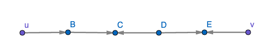
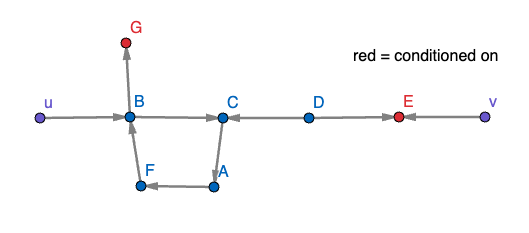
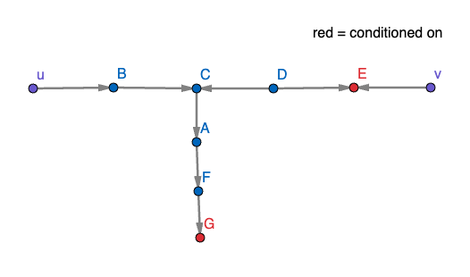
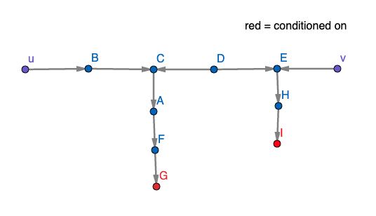
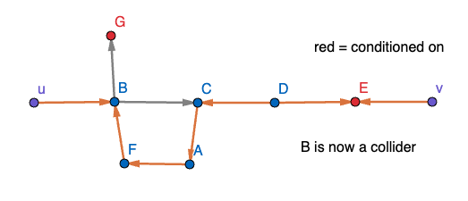
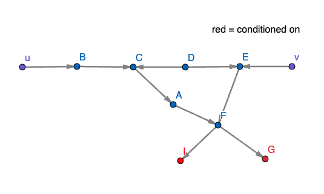
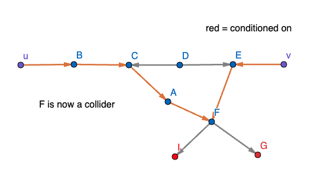

# Overall goal: show that if there is a $d$-connected path from $u$ to $v$, then there is an assignment of functions to nodes that equates all of the values on path

## Idea: assign functions based on whether node is mediator, confounder, or collider

## Issues arise if there are intersections between given $d$-connected path and descendant paths for colliders

## Goal: show that if there is a $d$-connected path from $u$ to $v$, then there is a "nice" $d$-connected path from $u$ to $v$

### Nice $\iff$ no intersections between any two descendant paths _or_ between descendant path and path itself.

### How to fix "bad" $d$-connected paths

Descendant path intersects path:

Descendant paths intersect each other:

