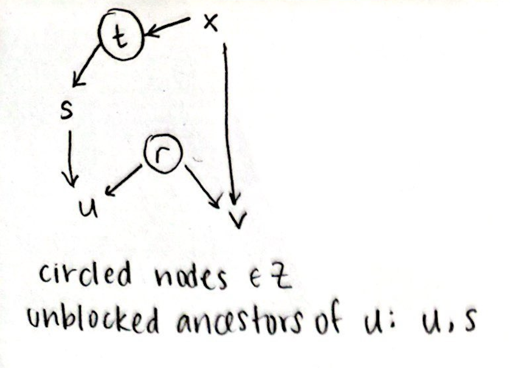
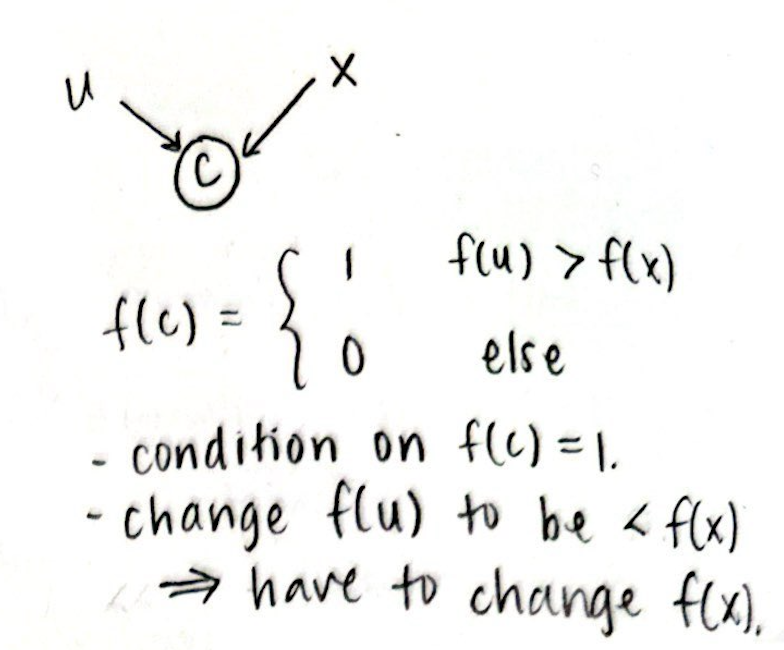
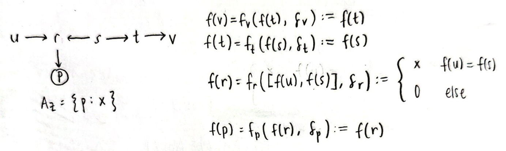
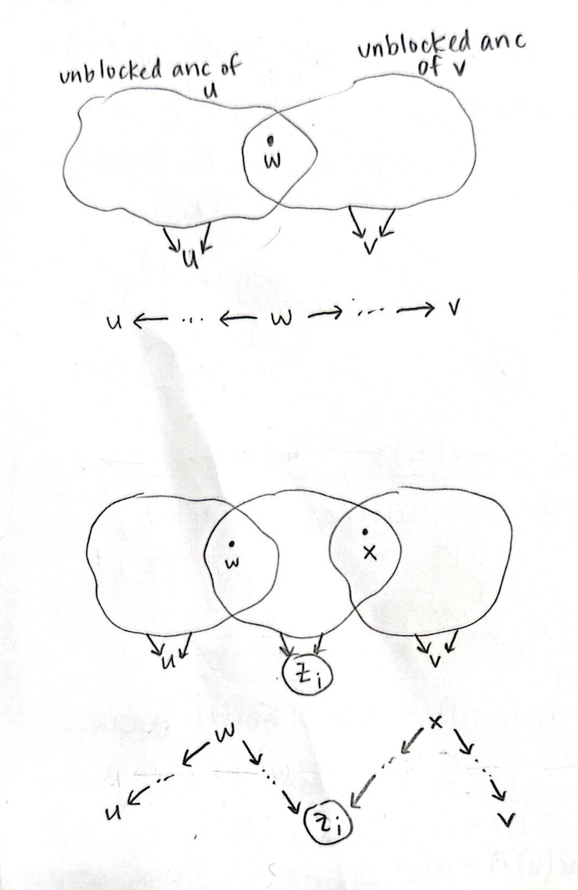

# Proving equivalence of $d$-separation and conditional independence

## Definitions

- A path is **$d$-connected** given set of nodes $Z$ if
  - for all mediators $m$ on the path, $m \not\in Z$
  - for all confounders $c$ on the path, $c \not\in Z$
  - for all colliders $c$ on the path, there exists some descendant $d$ of $c$ such that $d \in Z$
- Two nodes $u$ and $v$ are **$d$-separated** given $Z$ if no path from $u$ to $v$ is $d$-connected

## Semantics

- Each node $v$ is defined by a function $f_v$. In other words, the value of $v$ is given by $$f(v) = f_v(pa_v, u_v) = f_v([f(p_1), f(p_2), ..., f(p_k)], u_v)$$
  - $pa_v$: values of $p_1, ..., p_k$, the parents of $v$
  - $u_v$: some error term for $v$
- Two nodes $u$ and $v$ are **independent** conditioned on $Z$ if $f(v)$ is unaffected by $f(u)$, given that we know the values of nodes in $Z$ beforehand
- Formally, for all values $a, b$, $f(v)$ stays constant regardless of whether $f(u) = a$ or $f(u) = b$

```coq
forall (g: graphfun),
(forall (w: node),
    In w Z -> find_value G g w U = get_assigned_value A w)
-> forall (a b x: X),
(find_value G g u U = Some a -> find_value G g v U = Some x) ->
(find_value G g u U = Some b -> find_value G g v U = Some x).
```

## Independent $\Rightarrow$ $d$-separated

- Show that for each path, $d$-connected $\Rightarrow$ _not_ independent. Then, we have independent $\Rightarrow$ for all paths, not $d$-connected $\Rightarrow$ $d$-separated
- First show for 3-node paths with a mediator, confounder, and collider
- Use induction to extend to arbitrary length path
- Main idea: choose a specific $g$ to force $f(v)$ to depend on (often be equal to) $f(u)$

### Mediator: $u \rightarrow m \rightarrow v$

- Choose $f_v$ such that $f_v(pa_v, u_v) = f_v([..., f(m), ...], u_v) := f(m)$
- Similarly, set $f_m(pa_m, u_m) := f(u)$
  - _Not explicitly using $d$-connected assumption. Can we choose a function for $m$ even if $m \in Z$?_
- This forces $f(v) = f(u)$, so $u$ and $v$ cannot be independent

### Confounder: $u \leftarrow c \rightarrow v$

- Choose $f_v$ such that $f_v(pa_v, u_v) = f_v([..., f(c), ...], u_v) := f(c)$
- Similarly, set $f_u(pa_u, u_u) := f(c)$
- This forces $f(v) = f(u)$, so $u$ and $v$ cannot be independent
  - _This is using that $f(c)$ could take on at least 2 different values. Can we assume this if $c \not\in Z$?_

### Collider: $u \rightarrow c \leftarrow v$

- Since the path is $d$-connected, there is some descendant $d$ of $c$ such that $d\in Z$, so $f(d) = x$ always.

<p align="center">

</p>

- Choose $f(d) := f(d_k)$, ..., $f(d_2) := f(d_1)$, $f(d_1) := f(c)$
- Choose $f_c$ to force $f(u)$ and $f(v)$ equal:
  $$
  f_c(pa_c, u_c) = f_c([,..., f(u), ..., f(v), ...], u_c) =
  \begin{cases}
  x & f(u) = f(v)\\
  y & \text{else}
  \end{cases}
  $$
  This would ensure that $f(u)=f(v)$, or else a contradiction ($x \neq y$)
- Challenges:
  - Have to prove that changing the function for a node doesn't affect pre-existing the relationships between other node functions

### Arbitrary length path: $u \leftrightarrow u_1 \leftrightarrow u_2 \leftrightarrow \cdots \leftrightarrow u_k \leftrightarrow v$

- Base case is above three cases
- Induction step: assuming that there exists some graph function that makes $f(u_1) = \cdots = f(u_k) = f(v)$, show the same for $f(u)$.
- Basically use casework to see which of the above cases $u \leftrightarrow u_1 \leftrightarrow u_2$ falls into
- Challenge is modifying the graph function in a way that preserves existing equalities

<p align="center">

</p>
<p align="center">

</p>

- Might have to make a more general notion of node function affected by (?) other node function, rather than just strictly equal

## $d$-separated $\Rightarrow$ independent

### Easy case: the only path between $u$ and $v$ is $u \rightarrow m \rightarrow v$, and $m$ is the only parent of $v$

- Since $u, v$ are $d$-separated, $m \in Z$, so $f(m) = x$ always. Then, $f(v) = f_v(pa_v, u_v) = f_v([x], u_v)$, which is constant, so clearly $v$ is independent from $u$
- Since the definition of independence has to hold for all $a, b, x$, there's nothing that can show $f(u) = a$ (or maybe it never equals $a$)
  - _Should the definition of independence be reformulated?_

```coq
a, b, x: X
H1: f(u) = a -> f(v) = x
H2: f(u) = b
--
f(v) = x
```

### Slightly harder mediator case: the only path between $u$ and $v$ is $u \rightarrow m \rightarrow v$

- Now, $f(v) = f_v(pa_v, u_v) = f_v([..., x, ...], u_v)$
- Intuitively, the other parent values $f(p)$ can't depend on $u$, or else there must be a path from $u$ to that path (contradiction, because then there is a different path from $u$ to $v$). But this is hard to formally prove
  - Lemma: if there are no paths between nodes $w, x$, then $w, x$ are independent
  - From the lemma, can conclude that $u, p$ are independent (if not, then there must be a path between them, resulting in another path between $u, v$)

### General case: $u$ and $v$ are $d$-separated

- Harder, probably induction (or maybe prove not independent $\Rightarrow$ $d$-separated?)
- Now $u, p$ don't have to be independent -- there could be a path from $u \leftrightarrow \cdots \leftrightarrow p \leftrightarrow \cdots v$. We know that it's blocked, but we don't know where ($p$ could totally depend on $u$)

# Update (1/17/2025)

- Reformulated definition of conditional independence
- Worked through both directions on paper, partially proved both directions in Coq

## Conditional independence

### Informal procedure to determine if $u$ and $v$ are independent conditioned on $Z$:

1. Take setting of nodes that conditions on $Z$ such that the value of $u$ is $a$
2. Change the value of $u$ to $b$ and propagate the change throughout the graph
3. Ensure that the value of $v$ did not change

### Definitions and notation

- $U$: the assignments of unobserved error terms to nodes of $G$, where $U(u)$ denotes the unobserved error term for $u$
- $A_U$: the values of nodes in $G$ using unobserved terms $U$, where $A_U(u) = f_u(pa_u, U(u))$
- Conditioning on $Z$: given assignments $\{z_1: x_1, z_2: x_2, ... \}$ for nodes $z_i \in Z$, $A_U(z_i)$ always evaluates to $x_i$
- Unblocked ancestors of $u$: the nodes with an unblocked directed path to $u$
<p align="center">

</p>

### Formalized procedure

Let $U_a$ be any set of unobserved values such that

1. $A_{U_a}(u) = a$
2. For all $z_i \in Z$, $A_{U_a}(z_i) = x_i$

For $f_u(pa_u, U_a(u))$ to change to $b$, the value of an unblocked ancestor of $u$ must change (as a result of its unobserved term).

Let $U_b$ be any set of unobserved values such that

1. $A_{U_b}(u) = b$
2. $U_a$ and $U_b$ differ only for unblocked ancestors of $u$

It is possible that $A_{U_b}$ no longer properly conditions on $Z$, i.e. for some $z_i$, $f(z_i)$ no longer evaluates to $x_i$

<p align="center">

</p>

Let $U_b'$ be any set of unobserved values such that

1. $A_{U_b'}(u) = b$
2. For all $z_i\in Z$, $A_{U_b'}(z_i) = x_i$
3. $U_b'$ and $U_b$ differ only for unblocked ancestors of $z_i$ for which $A_{U_b}(z_i) \neq x_i$

**Conditional independence is satisfied** if for all $U_a, U_b, U_b'$ satisfying the requirements described above, $$A_{U_a}(v) = A_{U_b'}(v).$$

### Coq definition of conditional independence

```coq
Definition conditionally_independent (X: Type) `{EqType X} (G: graph) (u v: node) (Z: nodes): Prop :=
  forall (AZ: assignments X), is_assignment_for AZ Z = true
  (* properly conditioned, consistent assignments where f(u)=a *)
  -> forall (g: graphfun_r) (a: X) (Ua Aa: assignments X),
      get_values_r G g Ua 0 = Some Aa /\ unobs_valid_given_u G Ua Aa u a /\ unobs_conditions_on_Z G g Ua AZ Z
  (* assignments after setting f(u)=b and propagating *)
  -> forall (b: X) (Ub Ab: assignments X),
      (assignments_change_only_for_subset Ua Ub (find_unblocked_ancestors G u Z))
      /\ get_values_r G g Ub 0 = Some Ab /\ (unobs_valid_given_u G Ub Ab u b)
  (* assignments after resetting changed conditioned variables and propagating *)
  -> forall (Ub' Ab': assignments X),
      (assignments_change_only_for_subset Ub Ub' (find_unblocked_ancestors_in_Z G Z Aa Ab))
      /\ get_values_r G g Ub' 0 = Some Ab' /\ (unobs_valid_given_u G Ub' Ab' u b) /\ (unobs_conditions_on_Z G g Ub' AZ Z)
  (* value of v must stay constant *)
  -> get_assigned_value Aa v = get_assigned_value Ab' v.
```

## Conditionally independent $\Rightarrow$ $d$-separated

**Instead show that if a path is $d$-connected given $Z$, then the graph is _not_ conditionally independent on $Z$.**

Main idea (induction): provide function describing graph that properly conditions on $Z$ but forces the value of $v$ to equal the value of $u$.

<p align="center">

</p>

## $d$-separated $\Rightarrow$ conditionally independent

Rely on key **lemma**: for a node $u$, if $A_{U_1}(u) \neq A_{U_2}(u)$, then there must be a node $w$ such that

1. $w$ is an unblocked ancestor of $u$
2. $A_{U_1}(w) \neq A_{U_2}(w)$
3. $U_1(w) \neq U_2(w)$

### First part: $A_{U_a}(v) = A_{U_b}(v)$

Otherwise, some unblocked ancestor $w$ of $v$ must have changed its unobserved term from $U_a$ to $U_b$ (by the lemma). By the constraints on $U_b$, $w$ must also be an unobserved ancestor of $u$. This implies a $d$-connected path between $u$ and $v$ (top picture).

### Second part: $A_{U_b}(v) = A_{U_b'}(v)$

Otherwise, some unblocked ancestor $x$ of $v$ changed its unobserved term from $U_b$ to $U_b'$ (by the lemma). By the constraints on $U_b'$, $x$ must be an unobserved ancestor of $z_i \in Z$, such that $U_a(z_i) \neq U_b(z_i)$. Then, by the lemma, there must be some unblocked ancestor $w$ of $z_i$ that changed its unobserved term from $U_a$ to $U_b$. By the constraints on $U_b$, $w$ must also be an unobserved ancestor of $u$. This implies a $d$-connected path between $u$ and $v$ (bottom picture).

**Note**: it is possible that there are no _disjoint_ paths from $w$ to $z_i$ and $x$ to $z_i$. Say they intersect at a node $y$, and follow one of the paths down to $z_i$. Then, $y$ is a collider, and $z_i$ is a descendant of a collider which is conditioned on, so the path is still $d$-connected!

<p align="center">

</p>
