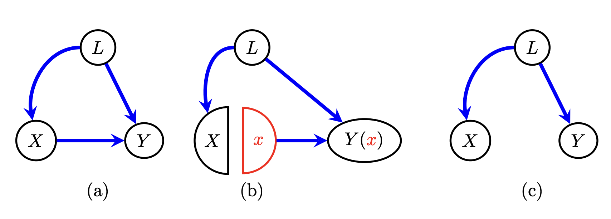
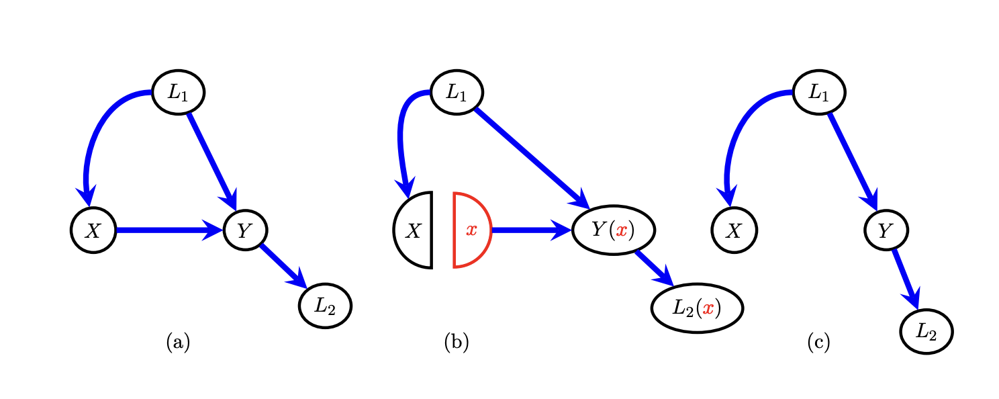
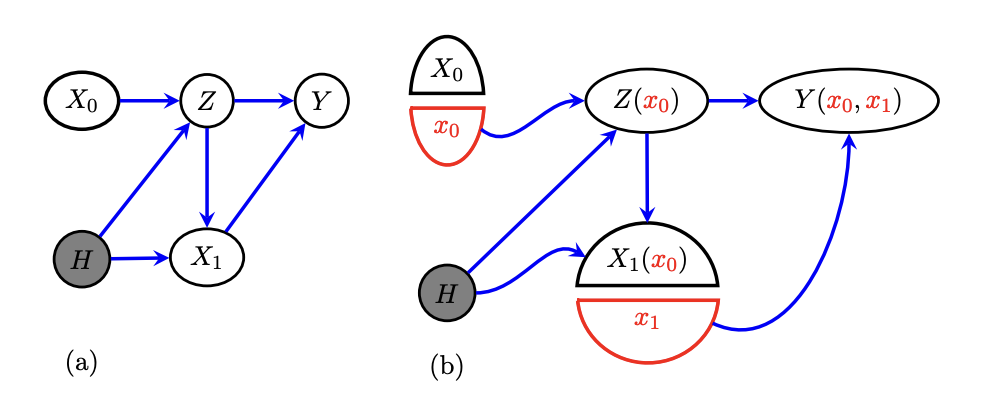
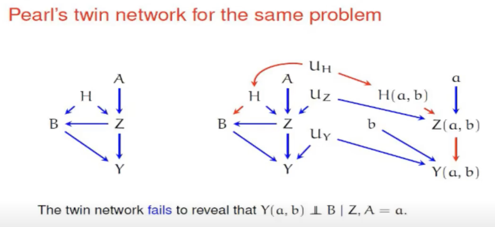

# Single World Intervention Graphs

## Motivation

- DAG representation of causal models is limited because it doesn't include **potential outcomes**
- Methods to address: structural equation models, tree graphs, Pearl's twin network
- SWIGs allow all information to be encoded in single graph, keeping
  the intuitive-ness of DAGs but with the added representation of counterfactuals

## Construction

### SWIG (b) vs. _do_ operator (c)

- Split node into random half and fixed half
- Arrows go into random half, leave from fixed half
- Descendants reflect corresponding value, i.e. $Y \rightarrow Y(x)$

## D-separation

### DAGs

Each path from $X$ to $Y$ must be blocked by either

1. Conditioning on mediator or confounder
2. Not conditioning on a collider **and not conditioning on any of its descendants**

### SWIGs

Each path from $X$ to $Y$ must be blocked by either

1. Conditioning on mediator or confounder
2. Not conditioning on a collider _(additional statement removed)_
3. Passing through a fixed node

- $ Y(x) \perp X \,|\, L_1 $ is true
- $ Y(x) \perp X \,|\, \{ L_1 , L_2 \}$ is not true

## Error in _Causality_

### _Sequential randomness example:_ effect of antiretroviral treatment on CD4 cell count

- $X_0$: treatment at time 0
- $Z$: HIV viral load just prior to time 1
- $X_1$: treatment at time 1
- $Y$: CD4 cell count at end of time 2
- $H$: unmeasured confounder

Equation of interest (conditional ignorability): $$Y(x_0, x_1) \perp X_1 \,|\, Z, X_0=x_0$$

Conditional ignorability ($Y(x) \perp X \,|\, Z$) in words: The way an individual with attributes $Z$ would react to treatment $X=x$ is independent of the treatment actually received by that individual.

This is sufficient to determine the causal effect of $X$ on $Y$ using the adjustment formula. (Very useful, but difficult to ascertain assumption of conditional ignorability.)

### Using SWIG

From Figure (b) and d-separation, $$Y(x_0, x_1) \perp X_1(x_0) \,|\, Z(x_0), X_0,$$ so setting $X_0=x_0$ maintains the independence.

### Using Twin Network method (Pearl)

There is a path that d-connects $B$ to $Y(a,b)$ in the twin network graph, so Pearl concludes that these two nodes are not independent.

However, $Z(a, b)$ is deterministically related to $Z$, just not explicitly in the graph. If the naturally occurring value of $A$ is $a$, then $Z = Z(a)$, and $Z(a) = Z(a, b)$ because there is no path from $Z$ to $B$.

In 2008, pre-processing step was introduced to overcome this issue, but difficult to apply; Pearl did not use it in the above example.

## Useful sources

- https://www.youtube.com/watch?v=NpNTfvbE1gY
- Causality, 2nd edition (Pearl 2009)
- Single World Intervention Graphs (SWIGs): A Practical Guide
